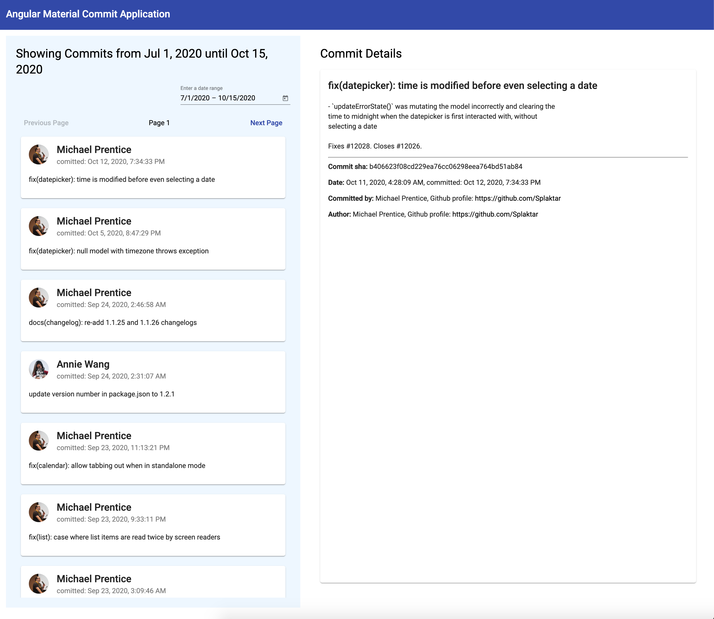

# CommitApp

This project was generated with [Angular CLI](https://github.com/angular/angular-cli) version 10.1.6.
It implements the Github API and fetches the latest commits from the Angluar Material Repo https://api.github.com/repos/angular/material/commits. 
It will fetch the commits from last month, with the latest commit on top of the list. By selecting a date range, an API call will be triggered which fetches the commits within that date range. By clicking an item in the list, the user will see a detail page which displays the full commit message, the date, the sha, the committer, and the author. 

## Technical Decisions

The project is built in Angular, since this would allow me to implement Typescript out of the box. The folders are structured by basic page elements; a header and a commit-folder. The commit folder contains all the components concerning commits. Subfolders follow the page's logic - the commit-list contains the commit-items, for example. 

In the commits-service, a basic cache for individual commits is implemented, which prevents unnecessary API calls. Whenever the page is refreshed, the commits-resolver service will fetch a single commit when it finds an empty cache, so the detail page can be revisited. 

Since I unfortunately do not have any testing-experience, I have focused on making the tests that ship with Angular pass, rather than writing tests myself.

## Available Scripts

Before running the application, it is recommended to install the Angular CLI: `npm install -g @angular/cli`. In the project directory, you can run:

### Node Package Manager

Run `npm install` to install the dependencies in the local node_modules folder.

### Serve

Run `ng serve` for a dev server. Navigate to `http://localhost:4200/`. The app will automatically reload if you change any of the source files.

### Build

Run `ng build` to build the project. The build artifacts will be stored in the `dist/` directory. Use the `--prod` flag for a production build.

### Running unit tests

Run `ng test` to execute the unit tests via [Karma](https://karma-runner.github.io).

### Running end-to-end tests

Run `ng e2e` to execute the end-to-end tests via [Protractor](http://www.protractortest.org/).

## Future improvements, features and fixes
I have a few ideas for future improvements:

- Make a not-found page when the user navigates to a non-existent url;
- Make a Custom Material Theme;
- Style the detail page a bit more; maybe add some more information on the commit;
- Build an adapter to instantiate a class when fetching a commit, so that only the relevant properties are available in the frontend;
- Proper typing of this Commit Object. 
- Write more elaborate tests, including fetching mock data. 
